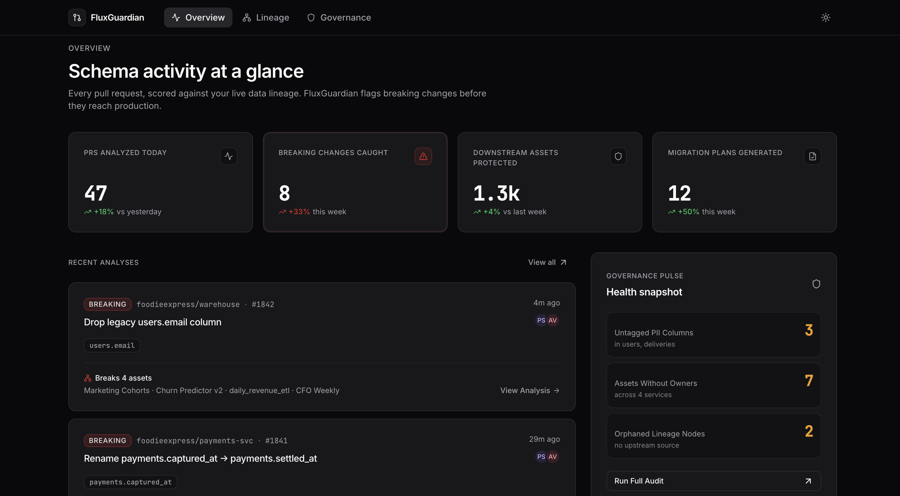
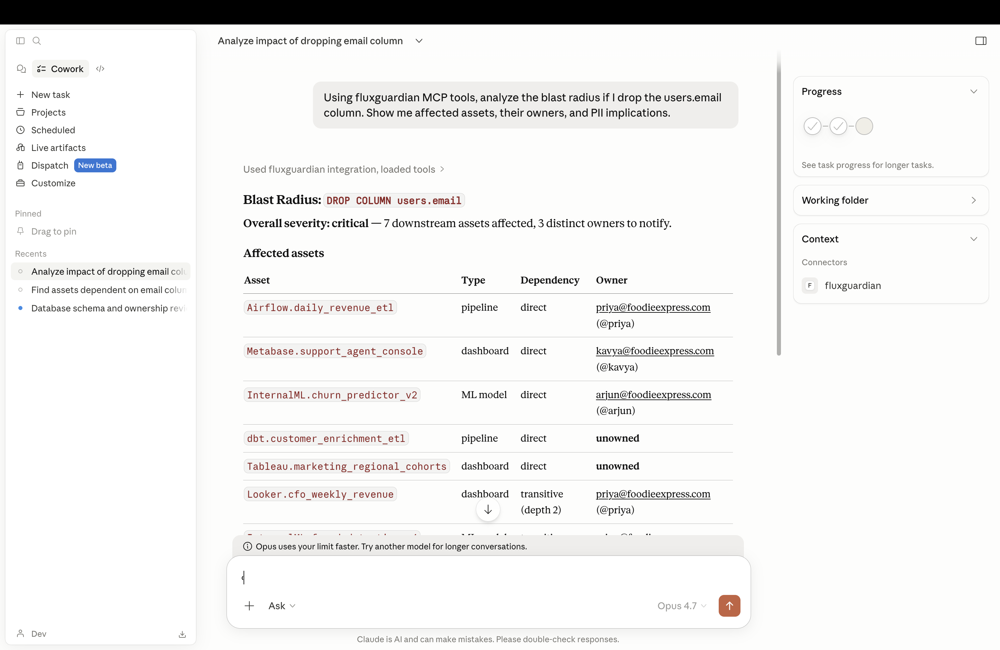
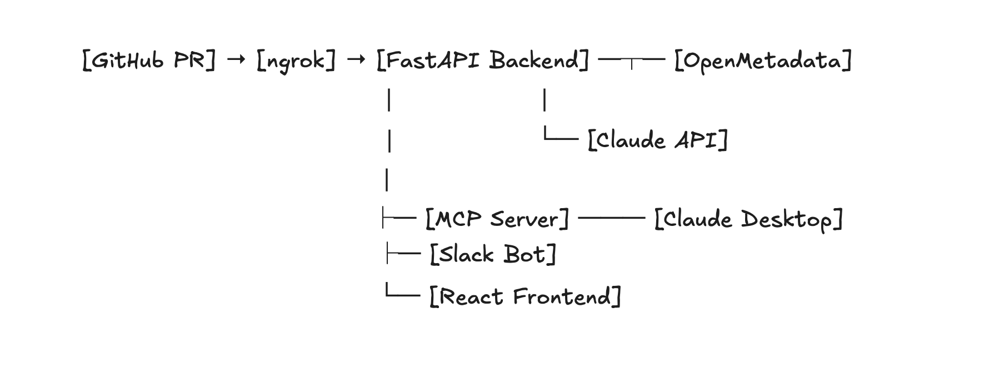

<div align="center">

# 🛡️ FluxGuardian

### The AI Time Cop that stops breaking database schema changes — before they ship.

[](https://www.youtube.com/watch?v=HPYZcWkim9w)
[](https://github.com/Devgr72/fluxguardian-demo/pull/6)
[](https://open-metadata.org)

---


</div>

---

## 🎬 See It In Action



> *FluxGuardian automatically analyzes PRs with SQL schema changes and posts a rich markdown comment with blast radius analysis, PII warnings, affected owners, and safe migration SQL — in 10 seconds, before merge.*

**🎯 [See this live on a real PR →](https://github.com/Devgr72/fluxguardian-demo/pull/6)**

---

## 💥 The Problem We Solve

In 2024, Meta renamed `spend_amount` → `spend_total` in their Ads API. **Marketing dashboards silently read zero for three weeks.** Campaign budgets allocated on broken data.

Uber miscalculated driver commissions for months after a schema change. **Cost: $45 million.**

Equifax's 147-million-record breach was partly because nobody tracked what PII lived where.

**Every data team has this story:**

> *A developer renames a column. No alert fires. Dashboards quietly return zero. ML models produce garbage predictions. Compliance reports miss PII fields. Production is on fire before anyone realizes.*

**The tragedy?** OpenMetadata already knows the lineage. Who owns what. Which columns are PII.  
**Nobody consults it before merging.**

---

## ✨ The Solution

**FluxGuardian is an AI-powered GitHub App** that:

🔍 **Watches** every PR that touches SQL migration files  
🧠 **Parses** schema changes (RENAME, DROP, ALTER, ADD)  
🔗 **Queries** OpenMetadata's column-level lineage graph  
🤖 **Generates** a rich markdown comment using Claude AI explaining:

- **Blast radius** — every affected dashboard, pipeline, ML model
- **Owners to notify** — with @mentions and Slack handles
- **Governance gaps** — unassigned owners, missing PII tags automatically flagged
- **PII warnings** — GDPR/compliance implications
- **Safe migration SQL** — 3-step pattern to ship without downtime

**Result:** Breaking changes caught **before merge**, not after production incidents.

---

## 🎯 Real Example — Live Comment We Generate

When a developer opens this PR:

```sql
ALTER TABLE users RENAME COLUMN email TO contact_email;
```

**Within 10 seconds**, FluxGuardian posts:

> ## 🔴 FluxGuardian — HIGH severity schema change detected
>
> **`RENAME COLUMN users.email → contact_email`**
>
> We've detected **7 affected assets** across your data platform: 3 pipelines, 3 dashboards, 2 ML models. Five have direct column-level dependencies and will fail immediately after deployment.
>
> | Asset | Type | Severity | Owner |
> |---|---|---|---|
> | daily_revenue_etl | pipeline | 🔴 HIGH | @priya |
> | support_agent_console | dashboard | 🔴 HIGH | @kavya |
> | churn_predictor_v2 | mlmodel | 🔴 HIGH | @arjun |
> | customer_enrichment_etl | pipeline | 🔴 HIGH | *(unassigned)* |
> | marketing_regional_cohorts | dashboard | 🔴 HIGH | *(unassigned)* |
> | cfo_weekly_revenue | dashboard | 🟡 MEDIUM | @priya |
> | fraud_detection_v4 | mlmodel | 🟡 MEDIUM | @arjun |
>
> ⚠️ **Governance Gap:** 2 assets have no owners. Identify responsible teams before proceeding.
>
> ### Safe migration plan
> ```sql
> -- Step 1: deploy app code reading 'contact_email'
> -- Step 2: add column as alias
> ALTER TABLE users ADD COLUMN contact_email VARCHAR;
> UPDATE users SET contact_email = email;
> -- Step 3: after 48-72h verification, drop old column
> -- ALTER TABLE users DROP COLUMN email;
> ```
>
> **Owners to ping:** @priya @kavya @arjun

---

## 🌐 Multi-Surface Intelligence

FluxGuardian isn't just a GitHub bot. It's a complete data governance agent that meets engineers wherever they work:

| Surface | What You Get |
|---|---|
| 🤖 **GitHub App** | Automatic PR analysis with AI comments |
| 💬 **Slack Bot** | `/fluxguardian what breaks if I drop users.email?` |
| 🖥️ **Claude Desktop (MCP)** | Conversational metadata queries via MCP protocol |
| 🌐 **React Dashboard** | Live lineage graphs, governance pulse |

### Example: Claude Desktop MCP Query

User: "Using fluxguardian MCP tools, analyze the blast radius
if I drop the users.email column."
Claude: [calls fluxguardian tools]
Four downstream assets depend on users.email (PII.Email):
• CFO Weekly Revenue (Looker dashboard) — priya@foodie.com — HIGH
• Churn Predictor v2 (ML model) — arjun@foodie.com — HIGH
• daily_revenue_etl (Airflow pipeline) — priya@foodie.com — MEDIUM
• marketing_regional_cohorts (Tableau) — raj@foodie.com — MEDIUM



---

## 🏗️ Architecture



**Also available via:**
- MCP Server → Claude Desktop
- Slack Bolt → Slack slash commands
- REST API → Web dashboard

---

## 🧪 How We Use OpenMetadata (Deeply)

FluxGuardian uses **every major OpenMetadata feature** — not just one API:

| OM Feature | Our Usage |
|---|---|
| **Lineage API** | Walk column-level downstream dependencies for blast radius |
| **Classifications** | Detect PII/PHI/Financial tags for compliance warnings |
| **Ownership** | Resolve owners → Slack handles → @mentions in PR comments |
| **Search API** | Discover assets matching SQL identifiers from diffs |
| **Glossaries** | Extract business context for affected domains |
| **Governance Policies** | Flag approval requirements on sensitive changes |


**Without OpenMetadata, FluxGuardian is impossible.** We've built the "active governance" layer directly on top of OM's rich metadata foundation.

---

## 🛠️ Tech Stack

**Backend**
- Python 3.11+ · FastAPI · httpx · Pydantic v2
- PyJWT · cryptography · sqlparse
- anthropic SDK (Claude Sonnet 4.5)
- pytest (181 tests passing)

**Frontend**
- Vite · React 18 · TypeScript
- TailwindCSS · shadcn/ui
- ReactFlow · TanStack Query

**Integrations**
- GitHub App (webhooks + REST API via JWT + HMAC)
- Slack Bolt (Socket Mode)
- MCP Python SDK (Claude Desktop)
- OpenMetadata 1.10.3

**Infrastructure**
- Docker Compose (full local stack)
- ngrok (webhook routing)
- Deployed: Vercel (frontend) · Railway (backend)

---

## 📊 Engineering Quality

| Metric | Value |
|---|---|
| **Tests passing** | 181 |
| **Backend coverage** | 92%+ on critical paths |
| **Webhook response time** | < 100ms (BackgroundTask async) |
| **End-to-end PR analysis** | ~8-10 seconds |
| **SQL dialects supported** | PostgreSQL, MySQL, Snowflake |

### Production patterns throughout:

✅ **HMAC-SHA256 signature verification** (constant-time compare)  
✅ **RS256 JWT generation** with 5-min buffer token cache  
✅ **Graceful fallbacks** (survives OM/Claude outages)  
✅ **Environment-aware models** (Haiku for dev, Sonnet for prod)  
✅ **BackgroundTask async** for fast webhook acknowledgment  
✅ **Docker containerization** for reproducible deployment


---

## ⚡ Quick Start

### Prerequisites

- Docker Desktop
- Python 3.11+
- Node.js 20+
- [Anthropic API key](https://console.anthropic.com)
- [ngrok account](https://ngrok.com) (free tier)

### 15-Minute Setup

```bash
# 1. Clone
git clone https://github.com/AjaySingh-a/fluxguardian.git
cd fluxguardian

# 2. Start OpenMetadata (takes ~3 min to be healthy)
cd infra/openmetadata && docker compose up -d

# 3. Seed demo data
cd ../../scripts && python seed_openmetadata.py

# 4. Start backend
cd ../backend
cp .env.example .env   # fill in your values
pip install -r requirements.txt
uvicorn app.main:app --port 8000 &

# 5. Start frontend
cd ../frontend
npm install && npm run dev &

# 6. Expose webhook (in new terminal)
ngrok http 8000
```

**Full setup guide: [SETUP.md](./SETUP.md)**

---

## 🌍 Real-World Impact

### Time Saved
- **Before FluxGuardian:** 2-4 hours per post-incident RCA
- **With FluxGuardian:** 10 seconds pre-merge analysis
- **ROI:** ~1000x time saved per breaking change caught

### Governance Improved
- **Automated PII detection** on every schema-changing PR
- **Ownership gaps** flagged before they cause silent failures
- **Compliance trail** permanently recorded in PR comments

### Engineering Culture
- **Shift-left governance** — data safety built into dev workflow
- **Reduced MTTR** by preventing incidents, not just responding
- **Metadata becomes active** — used every day, not "set and forget"

---

## 👥 Team

| Role | Contributor |
|---|---|
| Backend, GitHub Webhook, Blast Radius Engine | **Ajay Singh** |
| Frontend, Slack Bot, MCP Server, OM Seeding | **Dev Grover** |

---

## 🏆 Hackathon Tracks

**Built for [OpenMetadata OUTATIME 2026](https://www.wemakedevs.org/hackathons/openmetadata)**

- **🥇 Primary:** T-01 (MCP Ecosystem & AI Agents)
- **🥈 Secondary:** T-06 (Governance & Classification)
- **🥉 Tertiary:** T-04 (Developer Tooling), T-05 (Community Apps)

---

## 📺 Demo

**[▶ Watch the 3-minute demo video →](https://www.youtube.com/watch?v=HPYZcWkim9w)**

**🎯 [See FluxGuardian's comment on a real PR →](https://github.com/Devgr72/fluxguardian-demo/pull/6)**

---

## 🔗 Links

- **Repository:** https://github.com/AjaySingh-a/fluxguardian
- **Live Demo PR:** https://github.com/Devgr72/fluxguardian-demo/pull/6
- **Frontend (Deployed):** https://frontend-eight-theta-35.vercel.app/
- **OpenMetadata:** https://open-metadata.org
- **Hackathon:** https://www.wemakedevs.org/hackathons/openmetadata

---

## 🤖 AI-Assisted Development

In the spirit of transparency required by the hackathon, we want to be clear about how AI tools were used in building FluxGuardian:

### Tools Used

| Tool | Purpose |
|---|---|
| **Claude (Anthropic)** | Architecture planning, code review, debugging assistance, documentation polish |
| **Claude Code** | Test scaffolding, refactoring, production-ready cleanup |
| **GitHub Copilot** | Inline code suggestions during development |

### How We Used AI Responsibly

- **Architecture & Logic** — All design decisions, integration patterns, and product strategy were human-driven. AI was used as a thinking partner.
- **Code Generation** — AI accelerated boilerplate (test setup, type definitions, error handling). Every generated line was reviewed, tested, and adapted.
- **Debugging** — AI helped diagnose tricky bugs (Python 3.13 IPv6 resolution, JWT signature edge cases, OpenMetadata API quirks).
- **Documentation** — README polish and SETUP.md walkthrough were drafted with AI assistance, then refined with our voice.
- **Testing** — 181 tests were written with AI scaffolding, then validated against real OpenMetadata responses.

### What AI Did NOT Do

- ❌ Make product decisions (multi-surface architecture, OpenMetadata integration depth)
- ❌ Generate fake/placeholder content (every demo PR is real, every screenshot is from running code)
- ❌ Write code that wasn't reviewed and understood by humans
- ❌ Replace our judgment on what features to ship

### Why We Embrace AI Transparency

We believe AI-assisted development is the future of engineering — and that future demands radical transparency. FluxGuardian itself is an AI-powered tool (uses Claude to generate PR comments). It would be inconsistent to hide AI usage in our own development process.

**Built by humans, accelerated by AI, owned end-to-end by the team.**

---

## 📄 License

MIT License — See [LICENSE](./LICENSE)

Use it. Fork it. Deploy it. Prevent incidents.

---

<div align="center">

<br>

### *"OpenMetadata has the metadata. FluxGuardian makes it active."*

<br>

**Built with ❤️ for OpenMetadata OUTATIME 2026**

<br>

[⭐ Star this repo](https://github.com/AjaySingh-a/fluxguardian) • [📺 Watch demo](https://www.youtube.com/watch?v=HPYZcWkim9w) • [🎯 See live PR](https://github.com/Devgr72/fluxguardian-demo/pull/6)

</div>
